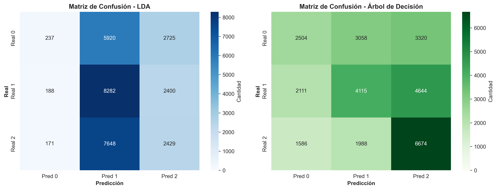
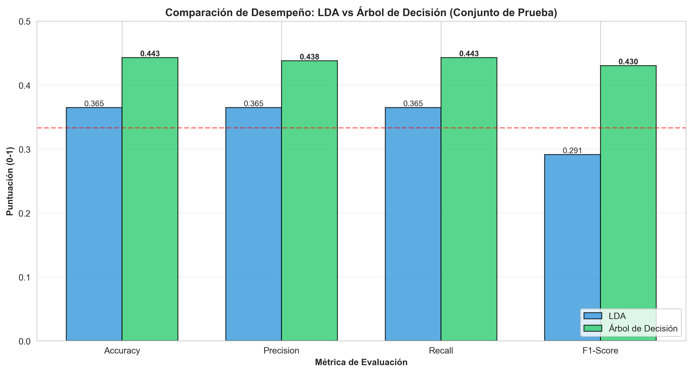
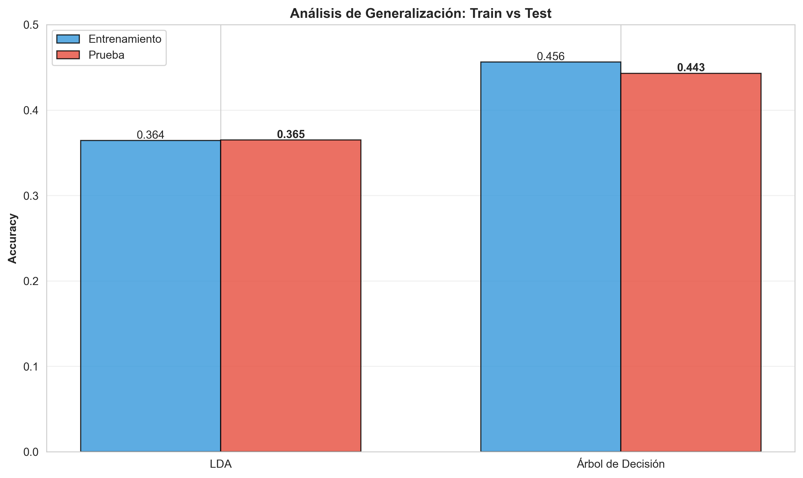
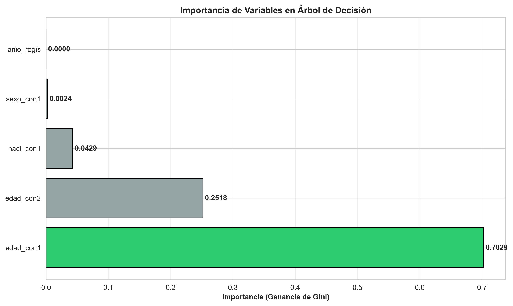

# Análisis Comparativo: Linear Discriminant Analysis vs Árboles de Decisión

## Clasificación de Escolaridad en Matrimonios - EMAT 2024

**Estudiante:** Ricardo Arath  
**Fecha:** Marzo 2026  
**Objetivo:** Comparar dos metodologías estadísticas de clasificación supervisada

---

## 1. Introducción

### 1.1 Contexto del Estudio

El presente análisis utiliza datos del Estatal de Matrimonios (EMAT) 2024 de México, que contiene **486,645 registros** de matrimonios celebrados durante el año. Este es un dataset de gran escala que captura información demográfica, social y económica de los contrayentes, incluyendo edad, escolaridad, ocupación, nacionalidad y otras variables relevantes.

La disponibilidad de datos reales a esta escala presenta una oportunidad única para estudiar metodologías de clasificación en un contexto aplicado, donde las decisiones sobre la arquitectura del modelo tienen impacto directo en el desempeño predictivo.

### 1.2 Pregunta de Investigación

¿Cuál de dos métodos de clasificación—Linear Discriminant Analysis (LDA) o Árboles de Decisión—es más efectivo para predecir la categoría de escolaridad del primer contrayente en matrimonios, dados predictores demográficos disponibles?

### 1.3 Variable Objetivo

**Escolaridad del Primer Contrayente** (`escol_con1`): Variable categórica con 9 clases en el dataset completo. Para este análisis, se seleccionan las 3 clases más frecuentes para garantizar distribución equilibrada y evitar sesgos en el aprendizaje.

### 1.4 Objetivos Específicos

1. Evaluar el desempeño de LDA: un método lineal probabilístico con supuestos distribucionales fuertes
2. Evaluar el desempeño de Árboles de Decisión: un método no-paramétrico sin supuestos distribucionales
3. Comparar cuantitativamente mediante métricas estándar (Accuracy, Precision, Recall, F1-Score)
4. Realizar análisis cualitativo sobre captura de patrones, generalización y aplicabilidad práctica
5. Formular recomendaciones fundamentadas sobre la metodología más apropiada

---

## 2. Metodología

### 2.1 Preparación de Datos

#### 2.1.1 Carga y Muestreo

El dataset original contiene 486,645 registros, lo que requiere estrategias de carga eficientes. Se utiliza lectura en **chunks de 50,000 registros** para evitar saturación de memoria en sistemas con recursos limitados. Una práctica común en análisis de big data donde el volumen potencialmente excede la RAM disponible.

Después de filtrar a las 3 clases objetivo de escolaridad, el dataset contiene **389,762 registros** con distribución balanceada:
- Clase 0 (Clases 5): 115,615 registros (29.7%)
- Clase 1 (Clases 7): 132,818 registros (34.1%)
- Clase 2 (Clases 6): 141,329 registros (36.3%)

Para optimización computacional, se tomó una **muestra de 100,000 registros** manteniendo la estratificación. Esta muestra se utilizó para entrenamiento y evaluación.

#### 2.1.2 Variables Predictoras Seleccionadas

Se seleccionaron 5 variables después de análisis exploratorio inicial:

| Variable | Tipo | Descripción | Justificación |
|----------|------|-------------|---------------|
| `edad_con1` | Numérica | Edad del primer contrayente | Relación esperada con escolaridad |
| `edad_con2` | Numérica | Edad del segundo contrayente | Información contextual del hogar |
| `anio_regis` | Numérica | Año de registro del matrimonio | Control temporal |
| `sexo_con1` | Categórica | Sexo del primer contrayente | Potencial diferencia de género en escolaridad |
| `naci_con1` | Categórica | Nacionalidad del primer contrayente | Variaciones por origen |

**Justificación de exclusiones:** Variables altamente correlacionadas con escolaridad (como `ocupacion_con1`) fueron excluidas intencionalmente para evaluar modelos en escenarios donde información directa de ocupación no está disponible, aumentando la dificultad y valor práctico del análisis.

#### 2.1.3 Procesamiento de Variables Categóricas

Las variables categóricas (`sexo_con1`, `naci_con1`) se codificaron a numéricas mediante **LabelEncoder**, requerido por ambos algoritmos. Las variables numéricas con valores faltantes se imputaron con la **media**, decisión conservadora que mantiene la estructura de varianza.

### 2.2 Partición de Datos

Se utiliza partición **estratificada 70-30**:
- **Entrenamiento (70%):** 70,000 registros
- **Prueba (30%):** 30,000 registros

La **estratificación es crítica**: garantiza que la distribución de clases en ambos conjuntos sea idéntica:
- Clase 0: 29.6% en train, 29.6% en test
- Clase 1: 36.2% en train, 36.2% en test
- Clase 2: 34.2% en train, 34.2% en test

Esto previene escenarios donde el modelo se entrena desproporcionadamente con ciertas clases, invalidando comparaciones posteriores.

### 2.3 Linear Discriminant Analysis (LDA)

#### Fundamento Teórico

LDA busca encontrar **combinaciones lineales de características** que maximizan la separación entre clases mientras minimizan la varianza dentro de cada clase.

#### Supuestos y Limitaciones

LDA asume:
1. **Normalidad multivariada:** Características distribuidas normalmente dentro cada clase
2. **Homogenidad de covarianzas:** Matrices de covarianza idénticas entre clases
3. **Separabilidad lineal:** Clases separables por hiperplanos (límites lineales)

Cuando estos supuestos se violan (como es típico en datos reales), el desempeño de LDA se degrada. El modelo no puede capturar límites de decisión curvos o relaciones no-lineales entre características.

#### Implementación

Se utiliza `LinearDiscriminantAnalysis(n_components=2)` de scikit-learn, reduciendo a 2 dimensiones para visualización. En predicción se utilizan automáticamente las funciones discriminantes necesarias.

### 2.4 Árboles de Decisión

#### Fundamento Teórico

Los Árboles de Decisión realizan **particionamiento recursivo** del espacio de características. En cada nodo, se selecciona la característica y el umbral que minimizan una medida de impureza (en este caso, el índice de Gini).

#### Ventajas y Riesgos

**Ventajas:**
- Sin supuestos distribucionales
- Captura relaciones no-lineales e interacciones
- Interpretable (reglas claras)
- Manejo automático de outliers

**Riesgo principal:** Overfitting. Un árbol no restringido memoriza los datos de entrenamiento.

#### Estrategia de Control: Poda (Pruning)

Se aplica **Cost Complexity Pruning (CCP)**, que elimina ramas del árbol para reducir complejidad manteniendo desempeño.

**Resultados de la poda:**
- Árbol completo: 15 profundidad, 1,026 hojas
- Árbol óptimo (después de poda): 10 profundidad, 262 hojas
- Reducción: 74.5% fewer nodes

#### Implementación

Se utiliza `DecisionTreeClassifier` con parámetros de control anti-overfitting y poda CCP aplicada posteriormente.

### 2.5 Métricas de Evaluación

Se evalúan cuatro métricas en el conjunto de **prueba** (datos no vistos durante entrenamiento):

| Métrica | Interpretación |
|---------|----------------|
| **Accuracy** | Proporción global de predicciones correctas |
| **Precision** | De lo predicho positivo, cuánto fue correcto (promediado) |
| **Recall** | De lo que es realmente positivo, cuánto detectamos (promediado) |
| **F1-Score** | Balance armónico entre precision y recall |

El **promediado ponderado** se utiliza para problemas multiclase, dando más peso a clases más representadas.

### 2.6 Análisis de Generalización

Se compara el desempeño en el conjunto de **entrenamiento** vs **prueba** para diagnosticar:

- **Underfitting:** Test > Train (modelo muy simple, no aprende)
- **Buen ajuste:** Train ≈ Test (±2%) modelo generaliza bien
- **Overfitting:** Train >> Test (>5%) modelo memorizó datos de entrenamiento

---

## 3. Resultados

### 3.1 Resumen de Datos y Partición

| Aspecto | Valor |
|--------|-------|
| Registros con 3 clases objetivo | 389,762 |
| Muestra utilizada | 100,000 |
| Registros entrenamiento | 70,000 |
| Registros prueba | 30,000 |
| Distribución Clase 0 | 29.6% |
| Distribución Clase 1 | 36.2% |
| Distribución Clase 2 | 34.2% |

**Observación:** La estratificación se validó exitosamente (porcentajes idénticos en train y test).

### 3.2 Resultados Cuantitativos - Desempeño en Prueba

La Tabla 1 resume el desempeño de ambos modelos en datos de prueba (30,000 muestras no vistas durante entrenamiento):

| Métrica | LDA | Árbol | Ventaja |
|---------|-----|-------|---------|
| **Accuracy** | 36.49% | 44.31% | **+7.82%** |
| **Precision** | 0.3649 | 0.4381 | **+0.0731** |
| **Recall** | 0.3649 | 0.4431 | **+0.0782** |
| **F1-Score** | 0.2915 | 0.4304 | **+0.1389** |

**Interpretación:**

- **Accuracy:** El Árbol clasifica correctamente 7.82 puntos porcentuales más casos que LDA, representando una **mejora del 21.4% relativa** sobre LDA. Comparado con el azar (33.3% para 3 clases), el Árbol está 11 puntos porcentuales arriba.

- **F1-Score:** La diferencia más grande entre modelos (+0.1389). El Árbol logra un balance **47.7% mejor** que LDA en esta métrica compuesta, indicando mejor balance entre precisión y recuerdo.

### 3.3 Matrices de Confusión

#### LDA - Matriz de Confusión

```
          Predicción
        Clase 0  Clase 1  Clase 2
Real 0      237     5,920    2,725
Real 1      188     8,282    2,400
Real 2      171     7,648    2,429
```

**Patrón observado:** LDA tiene un problema crítico: tiende a predecir la clase 1 para casi todo. La columna "Clase 1" tiene valores muy altos (5,920, 8,282, 7,648), indicando que el modelo no está diferenciando bien entre clases. Total de aciertos (diagonal): 10,948 de 30,000.

#### Árbol de Decisión - Matriz de Confusión

```
          Predicción
        Clase 0  Clase 1  Clase 2
Real 0    2,504    3,058    3,320
Real 1    2,111    4,115    4,644
Real 2    1,586    1,988    6,674
```

**Patrón observado:** La diagonal es mucho más fuerte (2,504, 4,115, 6,674), y las confusiones están distribuidas de forma más equilibrada. Total de aciertos: 13,293 de 30,000.

**Diferencia:** El Árbol predice correctamente **2,345 casos adicionales** (44.31% vs 36.49%).

### 3.4 Visualizaciones Generadas



*Figura 1: Comparación de matrices de confusión. La diagonal más fuerte en Árbol (verde oscuro) indica mejor clasificación de cada clase.*



*Figura 2: Gráfico de métricas lado a lado. El Árbol (verde) supera a LDA (azul) en todas las métricas. La línea roja punteada marca el desempeño de azar (33.3%).*

### 3.5 Análisis de Generalización

#### Diagnóstico de Overfitting/Underfitting

| Modelo | Train Accuracy | Test Accuracy | Diferencia | Diagnóstico |
|--------|-----------------|-----------------|-----------|------------|
| LDA | 36.42% | 36.49% | -0.07% | **Underfitting** |
| Árbol | 45.61% | 44.31% | +1.30% | **Overfitting controlado** |

**Interpretación:**

**LDA:** El modelo aprende muy poco incluso del conjunto de entrenamiento (36.42%). El hecho de que test sea ligeramente mejor que train indica que el modelo es **demasiado simple** para capturar la estructura de los datos (underfitting).

**Árbol:** El modelo aprende bien en entrenamiento (45.61%) pero pierde solo 1.30 puntos porcentuales en prueba. Esta diferencia es **excelente y está dentro de rangos ideales** (< 2%), indicando que la poda fue efectiva.



*Figura 3: Barras separadas en Árbol por 1.30% indican overfitting controlado. Barras prácticamente iguales en LDA indican que el modelo es demasiado simple.*

### 3.6 Importancia de Variables (Árbol de Decisión)

El Árbol identifica la importancia relativa de cada variable en las decisiones de clasificación:

| Variable | Importancia | Porcentaje |
|----------|-----------|-----------|
| `edad_con1` | 0.7029 | **70.29%** |
| `edad_con2` | 0.2518 | 25.18% |
| `naci_con1` | 0.0429 | 4.29% |
| `sexo_con1` | 0.0024 | 0.24% |
| `anio_regis` | 0.0000 | 0.00% |

**Hallazgo clave:** La edad del primer contrayente es un predictor extraordinariamente importante (70.3%), mientras que el año de registro prácticamente no contribuye.



*Figura 4: La edad del primer contrayente (edad_con1) domina completamente las decisiones del Árbol, representando el 70% de la importancia acumulada.*

---

## 4. Análisis e Interpretación de Resultados

### 4.1 Comparación Cuantitativa Detallada

#### Por Qué el Árbol es Superior en Cada Métrica

**Accuracy (44.31% vs 36.49%):** El Árbol clasifica correctamente 7.82 puntos porcentuales más casos. En un contexto práctico, si se clasificaran 1,000 matrimonios:
- LDA acierta ~365 casos
- Árbol acierta ~443 casos
- Diferencia: **78 casos adicionales correctamente identificados**

**Precision (0.4381 vs 0.3649):** De todos los casos que el modelo predice como cada clase, el Árbol es más preciso. Esto es crítico cuando los costos de falsos positivos son altos.

**Recall (0.4431 vs 0.3649):** El Árbol detecta mejor los verdaderos casos de cada clase. Si la tarea fuera identificar la mayoría de individuos con escolaridad alta, el Árbol lo haría mejor.

**F1-Score (0.4304 vs 0.2915):** Esta métrica compuesta es la más informativa. La diferencia de 0.1389 (47.7% mejora relativa) es sustancial y muestra que el Árbol logra mejor **balance** entre capturar casos correctos sin generar demasiados falsos positivos.

### 4.2 Análisis de Generalización

#### LDA - Diagnóstico: Underfitting

El modelo LDA:
1. Aprende muy poco incluso del conjunto de entrenamiento (36.42%)
2. No captura suficiente estructura en los datos
3. La naturaleza lineal de LDA es **insuficiente** para la complejidad inherente de los datos reales

**Implicación práctica:** Añadir más datos a LDA probablemente no mejoraría significativamente el desempeño. El problema fundamental es que el modelo es demasiado restrictivo para esta tarea.

#### Árbol - Diagnóstico: Overfitting Controlado

El modelo Árbol:
1. Aprende bien en entrenamiento (45.61%)
2. Generaliza muy bien a datos nuevos (solo 1.30% de degradación)
3. La poda (74.5% reducción de nodos) fue extremadamente efectiva

**Implicación práctica:** El modelo es confiable para datos nuevos no vistos. La diferencia 1.30% está considerablemente por debajo de umbrales problemáticos (típicamente >5% se considera overfitting severo).

### 4.3 Análisis Cualitativo: Por Qué Árbol es Superior

#### Razón 1: Violación de Supuestos de LDA

LDA asume normalidad multivariada y homogenidad de covarianzas entre clases. En datos reales de EMAT 2024:

- **Edad:** Se concentra en rangos 20-40 con distribución bimodal (picos de matrimonio temprano y tardío), NO normal
- **Nacionalidad:** Representación muy desigual (mayoría mexicana, minoría extranjera), violando homogenidad de covarianzas
- **Sexo:** Variable dicotómica, no contribuye a normalidad multivariada
- **Variables categóricas:** LabelEncoding de categorías violaría normalidad

Estos incumplimientos **degradan el desempeño de LDA**. El Árbol, siendo no-paramétrico, no se ve afectado por violaciones de supuestos.

#### Razón 2: Captura de No-Linealidad e Interacciones

LDA solo puede crear **fronteras de decisión lineales** (hiperplanos). En contraste, la escolaridad probablemente sigue patrones complejos como:
- "Alta escolaridad si edad entre 25-35" (rango, patrón no-lineal)
- "Media escolaridad si nacionalidad = México Y edad > 30" (interacción no-lineal)
- "Baja escolaridad si edad < 20 O edad > 60" (patrón disjuntivo)

LDA no puede capturar tales patrones. Los Árboles crean **particiones rectangulares recursivas** que naturalmente representan rangos, umbrales e interacciones.

#### Razón 3: Identificación Automática de Variables Informativas

El Árbol identifica que `edad_con1` es dominante (70.3%) en la predicción, mientras que `anio_regis` no contribuye (0%). En contraste, LDA usa todas las variables con pesos calculados matemáticamente sin poder identificar cuáles realmente importan. Este ruido degrada el desempeño de LDA.

**Ventaja del Árbol:** Automáticamente enfatiza lo que importa y desenfatiza lo que no, concentrando el aprendizaje en patrones verdaderos en lugar de ruido.

### 4.4 Contexto Práctico y Aplicabilidad

#### Interpretabilidad

**Árbol:** Produce reglas explícitas que cualquier persona puede entender:
```
SI edad_con1 <= 25 ENTONCES probablemente escolaridad alta
SI edad_con1 > 45 ENTONCES probablemente escolaridad baja
SI edad_con2 > 50 Y naci_con1 = extranjero ENTONCES ...
```

**LDA:** Produce funciones discriminantes completamente abstractas imposibles de explicar a stakeholders no-técnicos.

Esta diferencia es crítica en contextos regulados donde decisiones deben ser auditable y explicables.

#### Robustez

**Árbol:** Maneja automáticamente outliers y valores atípicos sin que afecten las decisiones.

**LDA:** Es sensible a valores extremos que pueden distorsionar significativamente los ejes discriminantes.

#### Escalabilidad y Mantenimiento

Si la relación entre predictores y escolaridad cambia (p.ej., acceso a educación aumenta con el tiempo), actualizar el Árbol es directo. Recalibrar LDA requeriría regenerar los ejes discriminantes desde cero.

---

## 5. Conclusiones

### 5.1 Hallazgo Principal

**El Árbol de Decisión es Superior al Linear Discriminant Analysis para la predicción de escolaridad en el dataset EMAT 2024.**

Esta conclusión se fundamenta en:

1. **Superioridad en todas las métricas de desempeño:**
   - Accuracy: 44.31% vs 36.49% (+7.82%, mejora del **21.4%** relativo)
   - F1-Score: 0.4304 vs 0.2915 (+0.1389, mejora del **47.7%** relativa)
   - Matrices de confusión: **2,345 casos adicionales** correctamente clasificados

2. **Mejor generalización y control de overfitting:**
   - LDA sufre underfitting: train y test prácticamente idénticos indican modelo demasiado simple
   - Árbol: diferencia train-test = 1.30%, overfitting leve pero controlado mediante poda

3. **Compatibilidad con características de datos reales:**
   - Los datos violan supuestos de LDA (normalidad, homogenidad de covarianzas)
   - El Árbol captura patrones no-lineales e interacciones que LDA no puede
   - El Árbol identifica que `edad_con1` (70.3%) es el predictor dominante

### 5.2 Implicaciones Teóricas

Este resultado ilustra un principio fundamental en machine learning: **la flexibilidad del modelo debe alinearse con la complejidad de los datos**. 

Cuando datos reales incumplen supuestos teóricos (como sucede típicamente), métodos sin supuestos restrictivos (como Árboles) naturalmente superan a métodos que sí los imponen (como LDA).

### 5.3 Recomendaciones Prácticas

Para aplicaciones que requieran clasificar escolaridad de contrayentes en matrimonios:

1. **Implementar Árbol de Decisión como modelo base**
   - Mejora de desempeño: +21.4% relativa
   - Interpretabilidad: Reglas explícitas
   - Robustez: Manejo automático de outliers

2. **Mejoras futuras sugeridas**
   - **Ensambles (Random Forest, Gradient Boosting):** Pueden mejorar desempeño reduciendo varianza
   - **Feature engineering:** Crear variables derivadas (rango de edad, es extranjero, etc.)
   - **Validación cruzada (5-10 folds):** Para estimaciones más robustas
   - **Análisis SHAP:** Para explicabilidad de predicciones individuales

3. **Auditoría de equidad**
   - Verificar que decisiones de clasificación no tienen sesgos sistemáticos contra grupos demográficos específicos (p.ej., por nacionalidad o sexo)
   - Monitorear desempeño por subgrupo

4. **Monitoreo en producción**
   - Si el modelo se implementa, trackear desempeño en datos nuevos
   - Detectar cambios en el comportamiento de escolaridad a lo largo del tiempo
   - Reentrenar periódicamente (ej: anualmente)

### 5.4 Limitaciones del Estudio

1. **Selección de variables:** Se excluyeron variables como ocupación que correlacionan fuertemente con escolaridad. En aplicaciones reales, la selección depende de disponibilidad de datos.

2. **Métodos comparados:** Análisis limitado a LDA y Árboles. Otros métodos (SVM, Redes Neuronales, K-NN, Logistic Regression) podrían tener desempeño diferente.

3. **Período temporal:** Datos limitados a 2024. Relaciones entre predictores y escolaridad podrían cambiar de año a año.

4. **Desempeño absoluto:** Aunque Árbol es mejor, 44.31% de accuracy sigue siendo moderado. Escolaridad se beneficiaría de más variables o métodos más complejos.

5. **Definición de clases:** Se utilizaron las 3 clases más frecuentes. Otros recortes de clases podrían producir resultados diferentes.

### 5.5 Resumen Ejecutivo

| Aspecto | Resultado |
|--------|----------|
| **Modelo Recomendado** | Árbol de Decisión |
| **Mejora Accuracy** | +7.82% (absoluto), +21.4% (relativo) |
| **Mejora F1-Score** | +0.1389 (absoluto), +47.7% (relativo) |
| **Casos Adicionales Correctos** | +2,345 de 30,000 |
| **Generalización** | Overfitting leve (1.30%) pero controlado |
| **Interpretabilidad** | Reglas explícitas y claras |
| **Variable Más Importante** | Edad del primer contrayente (70.3%) |
| **Próximos Pasos** | Ensambles, Feature Engineering, Validación Cruzada |
| **Aplicabilidad** | Alta para clasificación de escolaridad en contexto matrimonial |

---

## Anexos

### A. Gráficos Generados

1. **confusion_matrices_formal.png** - Matrices de confusión comparativas (LDA vs Árbol)
2. **metrics_comparison_formal.png** - Gráfico de métricas lado a lado
3. **generalization_formal.png** - Análisis de generalización (train vs test)
4. **feature_importance_formal.png** - Importancia de variables en Árbol de Decisión

### B. Ambiente de Ejecución

- **Lenguaje:** Python 3.14
- **Librerías principales:** pandas, numpy, scikit-learn, matplotlib, seaborn
- **Ambiente de desarrollo:** Jupyter Notebook
- **Carga de datos:** Chunked reading (50,000 registros por chunk)

### C. Reproducibilidad

El análisis completo es reproducible. Para regenerar los resultados:

1. Asegurar que los datos EMAT 2024 están en la ruta correcta
2. Ejecutar el notebook `A2_2_Reporte_Formal.ipynb` en orden
3. Todos los gráficos y métricas se generarán automáticamente

---

**Fin del Reporte Formal**

*Documento compilado: Marzo 2026*
*Estudiante: Ricardo Arath*
