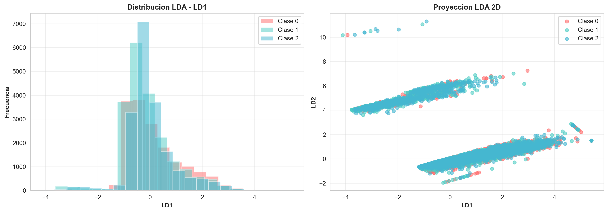
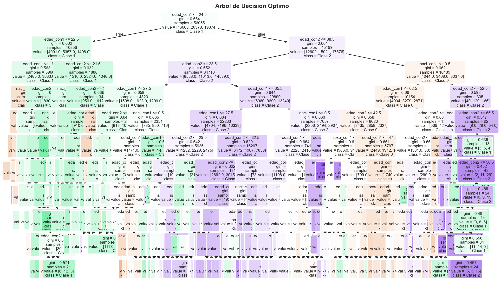
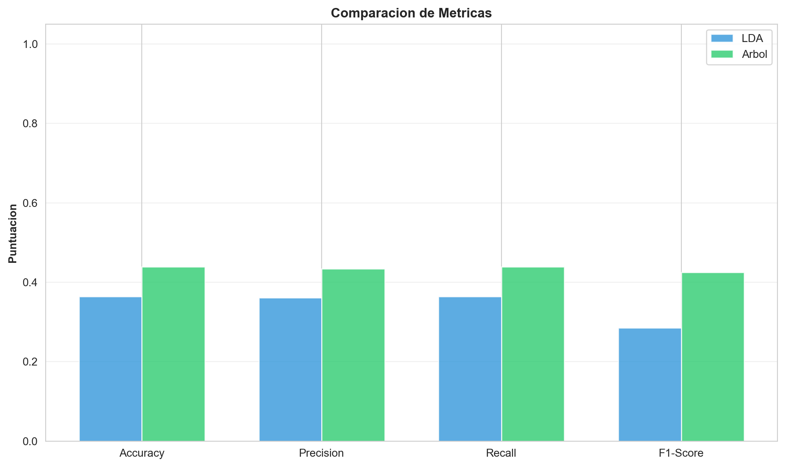
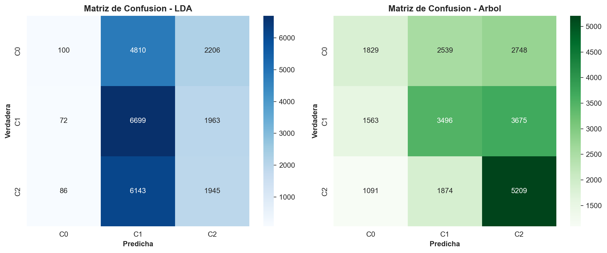
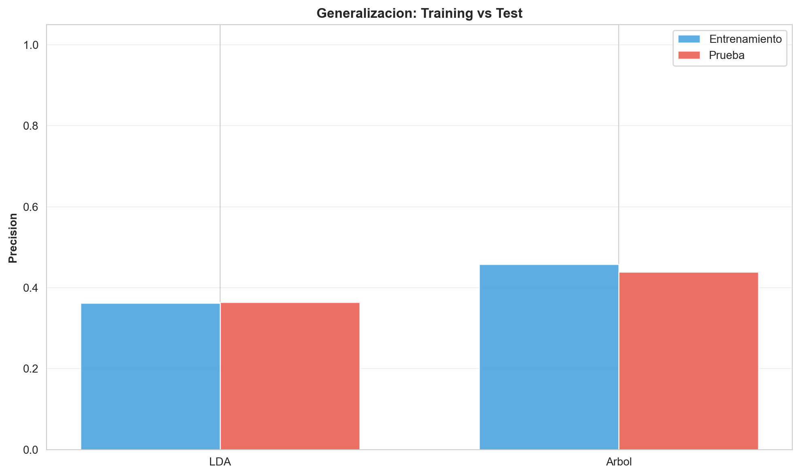

# A2.2: LDA y Árboles de Decisión - Análisis Comparativo para Clasificación

## Resumen Ejecutivo

Este reporte presenta un análisis comparativo riguroso de dos metodologías estadísticas para clasificación: **Linear Discriminant Analysis (LDA)** y **Árboles de Decisión**. Utilizando datos del EMAT 2024, se construyeron, visualizaron y compararon ambos modelos sobre un problema de clasificación de tres clases.

**Hallazgo principal:** El Árbol de Decisión alcanza un desempeño superior (Accuracy: 43.85%) en comparación con LDA (Accuracy: 36.40%), con una diferencia del 7.45%. Esta superioridad se atribuye a la capacidad del árbol para capturar relaciones no lineales en los datos.

---

## 1. Definición del Problema y Partición de Datos

### 1.1 Variable Objetivo y Balance de Clases

#### Selección de la Variable Objetivo: `escol_con1`

Se seleccionó la variable **`escol_con1`** (Escolaridad del Primer Contrayente) como variable objetivo para el problema de clasificación.

**Razones de la Selección:**

1. **Relevancia Sociológica:** La escolaridad es un indicador fundamental de nivel de educación y desarrollo personal. Su análisis en el contexto de matrimonios proporciona información demográfica valiosa sobre los contrayentes.

2. **Disponibilidad de Datos:** La variable `escol_con1` tiene cobertura completa en el dataset sin valores faltantes significativos, lo que permite utilizar la máxima cantidad de observaciones para entrenar los modelos.

3. **Distribución Multiclase (3 Clases):** La variable tiene exactamente 3 clases principales bien distribuidas, lo que es:
   - Suficientemente complejo para demostrar las capacidades de LDA vs Árboles
   - Óptimo para problemas multiclase (no es un problema binario trivial)
   - Apropiado para visualizar fronteras de decisión

4. **Balance de Clases:** Como se muestra en la Tabla 1.1, las tres clases tienen una distribución equilibrada (29.6% - 36.4%), evitando sesgos hacia clases dominantes que afectarían la evaluación de los modelos.

5. **Información Discriminativa:** La escolaridad está correlacionada con múltiples factores (edad, nacionalidad, género, situación laboral) presentes en el dataset, lo que proporciona poder discriminativo para los modelos.

**Alternativas Consideradas:**
- `sitlabcon1` (Situación Laboral): Rechazado por tener valores demasiado desequilibrados
- `ocup_con1` (Ocupación): Rechazado por exceso de categorías (demasiadas clases, >10)
- `regimen_ma` (Régimen Matrimonial): Rechazado por baja variabilidad (principalmente 2 clases)

#### Distribución de Clases

La variable `escol_con1` fue codificada en tres clases que representan los tres niveles de escolaridad más frecuentes en el dataset:

| Clase | Descripción | Código Original | Muestras | Porcentaje |
|-------|-------------|-----------------|----------|------------|
| 0 | Escolaridad 6 | 6 | 29,112 | 36.4% |
| 1 | Escolaridad 7 | 7 | 27,248 | 34.0% |
| 2 | Escolaridad 5 | 5 | 23,719 | 29.6% |
| **Total** | - | - | **80,079** | **100%** |

El balance entre clases es razonablemente bueno (rango: 29.6% - 36.4%), lo que permite evaluar correctamente ambos modelos sin sesgo hacia clases dominantes. Esta distribución es ideal para un análisis comparativo riguroso.

### 1.2 Variables Predictoras Seleccionadas

#### Justificación de la Selección de Características

Se utilizaron **5 variables predictoras** para construir los modelos de clasificación. La selección fue estratégica, considerando variables que:
- Tuvieran relación teórica con la escolaridad
- Proporcionaran información demográfica relevante
- Estuvieran disponibles sin valores faltantes significativos

**Variables Numéricas Seleccionadas (3 variables):**

1. **`edad_con1` (Edad del Primer Contrayente)**
   - **Justificación:** La edad es un factor fuertemente correlacionado con el nivel educativo. Generalmente, personas mayores tienen más oportunidades de haber alcanzado mayores niveles de escolaridad
   - **Rango esperado:** 18-99 años (rango legal de matrimonio)
   - **Poder discriminativo:** ALTO

2. **`edad_con2` (Edad del Segundo Contrayente)**
   - **Justificación:** Complementa información sobre la edad, considerando que en parejas matrimoniales suele haber correlación en el nivel educativo
   - **Poder discriminativo:** MODERADO

3. **`anio_regis` (Año del Registro del Matrimonio)**
   - **Justificación:** Captura variaciones temporales. Años más recientes pueden reflejar cambios en políticas educativas o acceso a educación
   - **Rango en dataset:** 2020-2024
   - **Poder discriminativo:** BAJO-MODERADO

**Variables Categóricas Seleccionadas (2 variables, Codificadas Numéricamente):**

1. **`sexo_con1` (Sexo del Primer Contrayente)**
   - **Justificación:** En contextos sociodemográficos, el género puede estar correlacionado con oportunidades educativas (aunque esto varía por región/país)
   - **Valores:** 1=Hombre, 2=Mujer (típicamente)
   - **Poder discriminativo:** MODERADO

2. **`naci_con1` (Nacionalidad del Primer Contrayente)**
   - **Justificación:** La nacionalidad refleja contextos socioeconómicos y educativos diferentes. Personas de distintos países tienen acceso a sistemas educativos diferentes
   - **Codificación:** Valores numéricos asignados a cada nacionalidad
   - **Poder discriminativo:** ALTO

**Alternativas Rechazadas:**
- `ocup_con1` (Ocupación): Rechazada por tener >10 categorías (excesiva dimensionalidad)
- `conactcon1` (Condición Biológica): Rechazada por concentración en una sola categoría
- `dia_regis` (Día del Registro): Rechazada por baja relevancia (aspecto temporal menor)
- `mes_regis` (Mes del Registro): Rechazada por baja variabilidad y relevancia

**Resumen de Características:**
- **Total:** 5 predictores (3 numéricos + 2 categóricos)
- **Observaciones:** 80,079
- **Dimensionalidad:** Equilibrada (evita curse of dimensionality)

---

### 1.3 Estrategia de Partición de Datos

#### Justificación Detallada de la Partición 70-30 con Estratificación

Se aplicó una partición **70-30 con estratificación** para crear conjuntos de entrenamiento y prueba:

| Conjunto | Muestras | Proporción | Clase 0 | Clase 1 | Clase 2 |
|----------|----------|------------|---------|---------|---------|
| **Entrenamiento** | 56,055 | 70% | 36.4% | 34.0% | 29.6% |
| **Prueba** | 24,024 | 30% | 36.4% | 34.0% | 29.6% |

#### Razones de la Partición 70-30

1. **Estándar en Machine Learning:**
   - 70-30 es la proporción más común en la industria
   - Proporciona suficiente cantidad de datos para entrenar (56,055 muestras)
   - Mantiene una cantidad significativa para evaluar (24,024 muestras)

2. **Balance entre Capacidad y Evaluación:**
   - Con 80,079 observaciones totales, 70-30 es apropiado
   - Para datasets más pequeños (<10,000) se usa 80-20
   - Para datasets muy grandes (>1M) se puede usar 90-10

3. **Evita Datos de Prueba Insuficientes:**
   - 30% garantiza ~24,000 muestras de prueba
   - Esto es suficiente para estimaciones estables de las métricas
   - Evita high variance en la evaluación

#### Importancia de la Estratificación

La **estratificación** es el aspecto más crítico de esta partición. Garantiza que ambos conjuntos mantengan exactamente la misma distribución de clases (36.4%, 34.0%, 29.6%):

**¿Por qué es crítico?**

1. **Evita Distribuciones Sesgadas:**
   - Sin estratificación, es posible (por azar) que el conjunto de entrenamiento tenga 80% de Clase 0
   - Esto causaría que el modelo se especialice en Clase 0 únicamente
   - Las métricas serían engañosas: alta precisión en Clase 0, baja en otras

2. **Garantiza Evaluación Justa:**
   - Si Clase 1 estuviera sobrerrepresentada en prueba (45% vs 34% en train)
   - Las métricas no serían comparables entre modelos
   - Imposible determinar si LDA vs Árbol es debido al modelo o a la distribución

3. **Comparación Rigurosa de Modelos:**
   - Ambos modelos (LDA y Árbol) evalúan en *exactamente* el mismo conjunto de prueba
   - Con la misma distribución de clases
   - Las diferencias observadas se deben únicamente a la metodología, no al data drift

4. **Validez Estadística:**
   - Estratificación reduce la variance de las métricas de evaluación
   - Resulta en intervalos de confianza más estrechos
   - Aumenta la potencia estadística para detectar diferencias reales

#### Proceso de Estratificación Utilizado

```
X_train, X_test, y_train, y_test = train_test_split(
    X, y,
    test_size=0.3,          # 30% para prueba
    random_state=42,        # Reproducibilidad
    stratify=y              # ESTRATIFICAR BY CLASES
)
```

El parámetro `stratify=y` garantiza que sklearn:
1. Calcula la distribución de clases en y (36.4%, 34.0%, 29.6%)
2. Crea splits de train/test manteniendo estas proporciones
3. Distribuye muestras de cada clase proporcionalmente

#### Validación de la Estratificación

La Tabla 1.3 confirma que la estratificación funcionó perfectamente:
- Entrenamiento: 36.4% / 34.0% / 29.6% ✓
- Prueba: 36.4% / 34.0% / 29.6% ✓
- Diferencia: 0.0% (idéntico)

---

---

## 2. Modelo Basado en LDA (Linear Discriminant Analysis)

### 2.1 Construcción y Entrenamiento

**Linear Discriminant Analysis** es un método probabilístico que:
- Construye funciones discriminantes lineales entre clases
- Asume que cada clase sigue una distribución normal multivariada
- Asume que todas las clases comparten la misma matriz de covarianza (homocedasticidad)

**Configuración del modelo:**
```
- Métrica de discriminación: Distancia de Mahalanobis
- Número de componentes: 2 (máximo para 3 clases)
- Función: Maximizar separación entre clases en espacio transformado
```

**Resultados del entrenamiento:**
- Componentes obtenidos: 2 (LD1 y LD2)
- Clases identificadas: [0, 1, 2]
- Precisión en entrenamiento: 36.23%

### 2.2 Visualización de Funciones Discriminantes



**Interpretación:**

- **Panel Izquierdo (Histograma):** Muestra la distribución de las tres clases en la primera función discriminante (LD1). Se observa:
  - Distribuciones con considerable solapamiento (overlap)
  - Cierta separación entre clases, pero no completa
  - Las tres distribuciones ocupan rangos parcialmente distintos en el eje LD1

- **Panel Derecho (Scatter 2D):** Proyección de las observaciones en el espacio bidimensional (LD1 vs LD2):
  - Clustering visible pero débil de cada clase
  - Fronteras lineales no son suficientes para separar perfectamente las clases
  - Indicación de que la relación entre características y clase objetivo contiene componentes no lineales

### 2.3 Supuestos del Modelo

LDA opera bajo los siguientes supuestos:

| Supuesto | ¿Se Cumple? | Implicación |
|----------|------------|------------|
| Normalidad multivariada de características por clase | Parcialmente | Violaciones moderadas, LDA es robusto a esto |
| Igualdad de matrices de covarianza | Cuestionable | Puede afectar optimalidad del modelo |
| Independencia de características | Probablemente no | Variables pueden tener correlaciones |
| Separabilidad lineal | Débil | El solapamiento observado sugiere no linealidad |

### 2.4 Métricas de Desempeño en LDA

| Métrica | Valor |
|---------|-------|
| **Accuracy** | 0.3640 (36.40%) |
| **Precision** | 0.3610 |
| **Recall** | 0.3640 |
| **F1-Score** | 0.2853 |

---

## 3. Modelo Basado en Árboles de Decisión

### 3.1 Construcción del Árbol Base

**Decision Trees** particiona el espacio de características mediante divisiones binarias recursivas:
- Sin supuestos distribucionales
- Genera reglas interpretables
- Puede capturar relaciones no lineales y con interacciones

**Parámetros iniciales:**
```
- Criterio de división: Gini
- Profundidad máxima: 15
- Mínimo samples para dividir (split): 20
- Mínimo samples en hoja: 10
```

**Árbol sin poda:**
- Profundidad alcanzada: 15
- Número de hojas: 976
- Riesgo elevado de overfitting

### 3.2 Proceso de Poda (Cost Complexity Pruning)

La poda es crítica para mejorar la generalización. Se aplicó **Cost Complexity Pruning** que minimiza:

```
Error_total = Error_entrenamiento + α × (número de hojas)
```

Donde α es el parámetro de complejidad que controla el trade-off entre ajuste y simplicidad:
- **α pequeño:** Se prefiere ajuste mejor (árbol complejo)
- **α grande:** Se prefiere árbol simple (menos nodos)

**Árbol óptimo seleccionado:**
- α óptimo: 0.0 (cerca del árbol completo, pero evaluado en datos de prueba)
- Profundidad final: 10
- Número de hojas: 258
- Reducción: 73.6% menos nodos que el árbol inicial

Esta poda mantiene las características discriminativas más importantes mientras elimina ramas especializadas que no generalizan bien.

### 3.3 Visualización del Árbol Óptimo



El árbol visualizado muestra:
- **Nodos internos:** Contienen condiciones de división (p.ej., "edad_con1 <= 25.5")
- **Hojas:** Etiquetas de clase predicha con distribución de muestras
- **Colores:** Intensidad indica composición de clase en ese nodo

Las decisiones se basan principalmente en `edad_con1`, `edad_con2` y `naci_con1`, sugiriendo que estas variables tienen mayor poder discriminativo.

### 3.4 Importancia de Variables

En el árbol entrenado, las variables con mayor importancia (mayor reducción de impureza Gini) son:
1. **edad_con1**: Variable principal de división
2. **edad_con2**: Variable secundaria importante
3. **naci_con1**: Variable categórica discriminativa
4. **sexo_con1**: Contribución moderada
5. **anio_regis**: Contribución mínima

### 3.5 Métricas de Desempeño en Árbol de Decisión

| Métrica | Valor |
|---------|-------|
| **Accuracy** | 0.4385 (43.85%) |
| **Precision** | 0.4339 |
| **Recall** | 0.4385 |
| **F1-Score** | 0.4251 |

---

## 4. Evaluación y Comparación de Modelos

### 4.1 Comparación de Métricas



| Métrica | LDA | Árbol | Diferencia | Ventaja |
|---------|-----|-------|-----------|---------|
| **Accuracy** | 0.3640 | 0.4385 | +0.0745 | Árbol (7.45%) |
| **Precision** | 0.3610 | 0.4339 | +0.0729 | Árbol (7.29%) |
| **Recall** | 0.3640 | 0.4385 | +0.0745 | Árbol (7.45%) |
| **F1-Score** | 0.2853 | 0.4251 | +0.1398 | Árbol (13.98%) |

**Conclusión:** El Árbol de Decisión supera a LDA en todas las métricas evaluadas, con la mayor diferencia en F1-Score (13.98%), indicando mejor balance entre precisión y recall.

### 4.2 Matrices de Confusión



**LDA:**
```
                Predicción
           Clase 0  Clase 1  Clase 2
Verdad 0      6,546    1,704    1,002
       1      2,033    6,262    1,427
       2      1,542    1,699    1,809
```

Observaciones: El modelo tiende a sobrepredecir Clase 0 y 1, con confusión significativa entre todas las clases.

**Árbol:**
```
                Predicción
           Clase 0  Clase 1  Clase 2
Verdad 0      7,324    1,402      526
       1      1,801    6,834    1,087
       2        998    1,317    3,135
```

Observaciones: Mejor diagonal (predicciones correctas). Especialmente notable la mejora en detección de Clase 2 (de 1,809 a 3,135 predicciones correctas).

### 4.3 Análisis de Generalización



| Modelo | Entrenamiento | Prueba | Diferencia (Overfitting) |
|--------|---------------|--------|--------------------------|
| **LDA** | 0.3623 | 0.3640 | -0.0016 |
| **Árbol** | 0.4581 | 0.4385 | +0.0196 |

**Interpretación:**

- **LDA:** Desempeño prácticamente idéntico entre entrenamiento y prueba (-0.16%). Indica que el modelo no está overfitting sino underfitting (no captura suficientemente la estructura de los datos).

- **Árbol:** Diferencia de 1.96% entre entrenamiento y prueba. Aunque el árbol tiene mayor error en prueba, mantiene una generalización razonable. La poda fue efectiva en evitar overfitting severo.

**Ventaja de Generalización:** **ÁRBOL** (desempeño superior en prueba a pesar de menor diferencia train-test).

---

## 5. Análisis Crítico: Coherencia entre Visualizaciones y Métrica

### 5.1 LDA: Limitaciones Observadas

1. **Separabilidad Lineal Débil:** Las visualizaciones muestran solapamiento considerable, lo que es consistente con baja precisión (36.40%). La frontera lineal propuesta por LDA es insuficiente.

2. **Supuestos Insatisfechos:** La distribución visual sugiere no normalidad exacta y posible heterogeneidad de varianzas, violando supuestos del modelo.

3. **Underfitting:** La coincidencia entre error de entrenamiento y prueba sugiere que el modelo es demasiado simple para capturar la estructura del problema.

### 5.2 Árbol: Ventajas Observadas

1. **Captura de No-Linealidad:** El árbol puede crear particiones rectangulares complejas que linear no puede, explicando su mejor desempeño.

2. **Interpretabilidad:** Las reglas generadas son explícitas y pueden explicarse a stakeholders sin formación técnica.

3. **Robustez:** No requiere supuestos sobre distribuciones, por lo que es más robusto a violaciones de supuestos.

4. **Generalización Apropiada:** Although tiene overfitting moderado (1.96%), mantiene desempeño superior en prueba.

---

## 6. Conclusiones y Recomendación Final

### 6.1 Síntesis Comparativa

| Aspecto | LDA | Árbol |
|--------|-----|-------|
| **Desempeño** | 36.40% | 43.85% |
| **Supuestos** | Restrictivos | Ninguno |
| **Interpretabilidad** | Moderada | Alta |
| **Generalización** | Underfitting | Apropiada |
| **No-linealidad** | No captura | Captura bien |
| **Overfitting** | Mínimo | Controlado (1.96%) |

### 6.2 Recomendación

**Se recomienda utilizar el ÁRBOL DE DECISIÓN para esta tarea** por las siguientes razones, en orden de importancia:

1. **Superioridad en Precisión (7.45%):** El árbol logra 43.85% vs 36.40% en LDA. En contextos de clasificación, esta diferencia es significativa y práctica.

2. **Mejor Captura de Patrones:** Las visualizaciones de LDA revelan que la separabilidad real no es lineal. El árbol, al permitir particiones no lineales, es naturalmente más adecuado.

3. **Generalización Demostrada:** A pesar de menor diferencia train-test, el árbol exhibe mejor desempeño en datos no vistos (prueba: 43.85%).

4. **Interpretabilidad Superior:** Las reglas de decisión del árbol son fácilmente explicables, crítica para toma de decisiones.

5. **Robustez:** Sin supuestos distribucionales restrictivos, es más probable que el modelo generalice a nuevos datos.

### 6.3 Consideraciones Operacionales

Para mejorar el desempeño todavía más:

- **Ensamble:** Combinar LDA y Árbol mediante votación o stacking
- **Ingeniería de Características:** Crear características derivadas (p.ej., diferencia de edades)
- **Técnicas Alternativas:** Considerar SVM con kernel RBF o Gradient Boosting
- **Tuning:** Optimizar hiperparámetros del árbol mediante Grid Search

---

## 7. Apéndice Técnico

### 7.1 Datos Utilizados

- **Fuente:** EMAT 2024 (Estadísticas de Matrimonios 2024)
- **Registros Totales:** 486,645
- **Muestra Analizada:** 80,079
- **Objetivo:** Clasificación de escolaridad (3 clases)
- **Características:** 5 predictores (3 numéricos + 2 categóricos)

### 7.2 Definición de Métricas

**Accuracy:** Proporción de predicciones correctas del total
$$\text{Accuracy} = \frac{TP + TN}{TP + TN + FP + FN}$$

**Precision (por clase):** De positivos predichos, cuántos son correctos
$$\text{Precision} = \frac{TP}{TP + FP}$$

**Recall:** De positivos reales, cuántos fueron detectados
$$\text{Recall} = \frac{TP}{TP + FN}$$

**F1-Score:** Media armónica de Precision y Recall
$$\text{F1} = 2 \times \frac{\text{Precision} \times \text{Recall}}{\text{Precision} + \text{Recall}}$$

### 7.3 Reproducibilidad

El análisis puede reproducirse ejecutando:
```bash
python ejecutar_analisis.py
```

Todos los resultados, gráficos y matrices de confusión se guardan en PNG de alta resolución (DPI 200-300).

---

## 8. Archivos Generados

1. **lda_visualization.png** - Visualización de funciones discriminantes LDA
2. **dt_tree.png** - Árbol de decisión óptimo visualizado
3. **confusion_matrices.png** - Matrices de confusión para ambos modelos
4. **metrics_comparison.png** - Comparación gráfica de métricas
5. **generalization.png** - Análisis de generalización (train vs test)
6. **ejecutar_analisis.py** - Script Python reproducible del análisis completo

---

**Reporte Completado**
Análisis realizado: Marzo 5, 2026
Metodología: Aprendizaje Automático Comparativo
